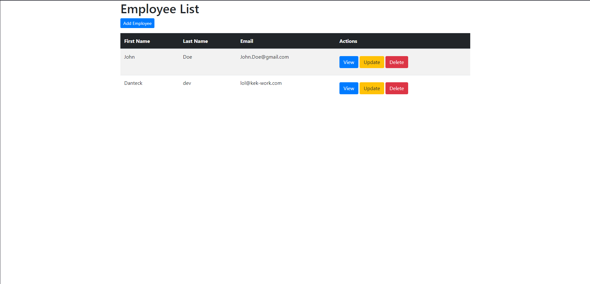

# Employee Management System (EMS) FullStack (Spring Boot + Thymeleaf)

## Описание проекта
Система управления сотрудниками (EMS) — это веб-приложение, разработанное на основе **Spring Boot**, **Thymeleaf** и **MySQL**. Система позволяет:
- Просматривать список сотрудников.
- Добавлять новых сотрудников.
- Редактировать информацию о сотрудниках.
- Удалять сотрудников.

## Стек технологий
- **Backend**: Spring Boot (Web, Data JPA)
- **Frontend**: Thymeleaf
- **База данных**: MySQL
- **Сборка проекта**: Maven

## Установка и запуск

### 1. Настройка базы данных
1. Убедитесь, что MySQL установлен и запущен.
2. Создайте базу данных:
   ```sql
   CREATE DATABASE employee_management;
   ```
3. Настройте подключение к базе данных в файле `application.properties`:
   ```properties
   spring.datasource.url=jdbc:mysql://localhost:3306/employee_management
   spring.datasource.username=your_username
   spring.datasource.password=your_password
   spring.jpa.hibernate.ddl-auto=update
   ```

### 2. Сборка и запуск приложения
1. Клонируйте репозиторий:
   ```bash
   git clone <URL репозитория>
   ```
2. Перейдите в папку проекта:
   ```bash
   cd ems-springboot-thymeleaf
   ```
3. Соберите проект:
   ```bash
   mvn clean install
   ```
4. Запустите приложение:
   ```bash
   mvn spring-boot:run
   ```

### 3. Доступ к приложению
Откройте в браузере: [http://localhost:8080](http://localhost:8080)

## Функционал
1. **Просмотр списка сотрудников**  
   Главная страница отображает список всех сотрудников с возможностью редактирования или удаления.

2. **Добавление сотрудника**  
   Нажмите кнопку "Добавить сотрудника" и заполните форму.

3. **Редактирование сотрудника**  
   Нажмите кнопку "Редактировать" рядом с нужным сотрудником и обновите данные.

4. **Удаление сотрудника**  
   Нажмите кнопку "Удалить" рядом с нужным сотрудником.

## Структура проекта
- **src/main/java**  
  - `com.danteck.ems` — основная логика приложения.
- **src/main/resources/templates**  
  - HTML-шаблоны Thymeleaf для фронтенда.
- **src/main/resources/application.properties**  
  - Конфигурация базы данных и приложения.

## Скриншоты
### Главная страница


### Добавление сотрудника


## Лицензия
Этот проект распространяется под лицензией MIT. Подробнее см. [LICENSE](LICENSE).

## Автор
Разработано Danteck. Для вопросов или предложений обращайтесь: lol@kek-work.com
